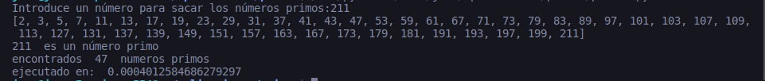

# Calculate prime numbers

Application make in console Python to calculate prime numbers to introduce one number. 

It show all previous prime number and it say you if that number is prime or not

## Code

Use as premise one array with first two prime numbers [2, 3] to find out other prime numbers up to the number entered.

- Not calculate pair numbers. Only odd numbers
- calculates up to half the number currently calculated
- calculate the elapsed time

## Example

